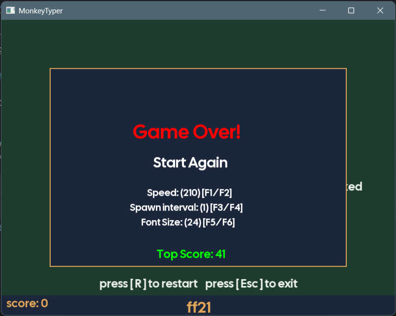

# ⌨️ MonkeyTyper C++

A minimalist, high-speed typing game built from scratch using **C++20** and the **SFML** graphics library. Test your typing speed and accuracy as words fall down the screen!



## ✨ Features
* **Real-time Word Generation:** Randomly selected words spawn and fall at adjustable intervals.
* **Typing Logic:** Detects correct and incorrect keystrokes with visual feedback.
* **Custom Settings:** Adjust speed, spawn rate, and font size directly in-game using F-keys.
* **Persistent Top Score:** Keeps track of your best performance.
* **Modern C++ Architecture:** Clean, modular code using OOP principles and `{fmt}` for string formatting.

## 📽️ Gameplay Demo
*(Drag and drop your MP4 file here in the GitHub editor to show the game in action!)*

## 🛠️ Tech Stack
* **Language:** C++20
* **Graphics:** SFML 3.0.0
* **Formatting:** {fmt} lib
* **Build System:** CMake (v3.24+)

## 🚀 How to Run

Because this project uses **CMake FetchContent**, you don't need to manually install SFML. The build system will download everything for you.

### 1. Prerequisites
* A C++20 compatible compiler (MinGW, Clang, or MSVC).
* [CMake](https://cmake.org/download/) installed.

### 2. Build Instructions
Open your terminal in the project folder and run:

```bash
# Configure the project (this downloads SFML & fmt)
cmake -B build -DCMAKE_BUILD_TYPE=Release

# Build the project
cmake --build build --config Release

